# Analýza pohybu osob ve videu s využitím neuronových sítí pro prostorově-temporální zpracování

## Cíl projektu

**Hlavní cíl:** Detekce hrozeb a podezřelých osob v davu pomocí automatizované analýzy videa z přehledových kamer.

Projekt implementuje systém pro analýzu pohybu osob ve videosekvencích, který kombinuje:
- **Prostorovou analýzu** - detekce osob a extrakce skeletu pomocí konvolučních neuronových sítí (RT-DETR, ViTPose)
- **Temporální analýzu** - klasifikace chování pomocí LSTM pro zpracování časových sekvencí pohybu

**Řešené úlohy:**
1. **Detekce normálního vs. abnormálního pohybu** - klasifikace chování osob (normální chůze, podezřelé chování, běh/panika)
2. **Analýza póz jednotlivců** - extrakce a vyhodnocení klíčových bodů skeletu (17 bodů COCO formátu)
3. **Sledování osob v davu** - tracking jednotlivců napříč framy ve videu
4. **Detekce podezřelých předmětů** - identifikace zbraní a nebezpečných objektů (v přípravě)

**Praktické využití:**
- Automatizované přehledové systémy (CCTV)
- Detekce bezpečnostních hrozeb v reálném čase
- Analýza davového chování
- Forenzní analýza záznamů z bezpečnostních kamer

---

## Struktura projektu

### Hlavní skripty a notebooky

#### Zpracování a extrakce dat
- **`extract_frames.py`** - Extrakce snímků z videí (2 FPS)
- **`extract_skeletons_two_stage.ipynb`** - Hlavní pipeline pro dvoufázovou detekci:
  - Fáze 1: RT-DETR detekce osob s preprocessing (CLAHE, histogram eq, gamma)
  - Fáze 2: ViTPose extrakce skeletu (17 keypoints)
  - Implementuje metodu `better_detection()` s multiple configs
  - Ukládá skelety jako `.npy` soubory

#### Vizualizace a labelování
- **`visualization_helper.py`** - Nástroj pro vizualizaci detekcí a skeletů:
  - 20 předefinovaných barev pro rozlišení osob
  - Vykreslování bounding boxů a skeletal keypoints
  - COCO skeleton connections (17 bodů)
  - Podpora vizualizace s/bez skeletů

- **`label_skeletons.py`** - Interaktivní GUI pro anotaci chování:
  - Tracking osob napříč framy
  - Manuální korekce automatického trackingu
  - Klasifikace chování: normální chůze (0), podezřelé (1), běh/panika (2)
  - Export do `.json` (metadata) a `.npz` (skelety + labels)

- **`label_skeletons_improved.py`** - Vylepšená verze labeleru (v přípravě)

#### Testování a porovnání
- **`test_rtdetr.py`** - Porovnání RT-DETR vs YOLO11x:
  - Férové srovnání (stejné conf, imgsz=640)
  - Generování grafů a vizualizací
  - Statistiky (precision, recall, FPS)

### Adresář `models/`

Obsahuje všechny použité modely a jejich konfigurace:

#### RT-DETR (Real-Time Detection Transformer)
```
models/rtdetr/
├── configs/
│   ├── rtdetr/
│   │   ├── rtdetr_r18vd_6x_coco.yml      # R18 backbone (rychlejší)
│   │   ├── rtdetr_r101vd_6x_coco.yml     # R101 backbone (přesnější)
│   │   └── include/
│   │       ├── dataloader.yml
│   │       └── optimizer.yml
│   └── rtdetrv2/
│       ├── rtdetrv2_r18vd_120e_coco.yml  # RT-DETRv2 R18
│       └── rtdetrv2_r101vd_6x_coco.yml   # RT-DETRv2 R101
├── src/                                   # RT-DETR implementace
└── *.pth                                  # Předtrénované váhy
```

**Dostupné checkpointy:**
- `rtdetrv2_r101vd_6x_coco_from_paddle.pth` - **RT-DETRv2 R101** (aktuálně používaný)
  - Používá se v `extract_skeletons_two_stage.ipynb` (produkční pipeline)
  - Používá se v `test_rtdetr.py` (porovnání s YOLO)
  - **ResNet-101 backbone** - vyšší přesnost, pomalejší
  - **Důvod použití:** Vytváření datasetu vyžaduje maximální přesnost

- `rtdetrv2_r18vd_120e_coco_rerun_48.1.pth` - **RT-DETRv2 R18** (připravený pro nasazení)
  - **ResNet-18 backbone** - rychlejší, menší model
  - **Důvod přípravy:** Pro budoucí real-time nasazení, kde je rychlost kritická
  - Zakomentovaný v `test_rtdetr.py` pro snadnou výměnu

**Poznámka k výběru modelu:**
- **Dataset creation (nyní):** R101 - potřebujeme co nejpřesnější skelety pro trénink LSTM
- **Production deployment (budoucnost):** R18 - rychlejší inference pro real-time CCTV analýzu

#### ViTPose (Vision Transformer Pose Estimation)
```
models/vitpose/
├── configs/
│   ├── ViTPose_huge_crowdpose_256x192_without_training_v3.py  # Produkční config
│   ├── ViTPose_huge_crowdpose_256x192.py
│   └── _base_/
│       ├── datasets/crowdpose.py
│       └── default_runtime.py
├── models/                                # Custom MMPose komponenty
│   ├── backbone/vit.py                    # ViT backbone
│   ├── detectors/top_down.py              # TopDown detektor
│   └── head/topdown_heatmap_simple_head.py
└── vitpose-h-multi-crowdpose.pth         # ViTPose-Huge váhy (2.4GB)
```

**Důležité:**
- Config `*_without_training_v3.py` odstraňuje závislosti na trénovací pipeline
- Custom komponenty v `models/` pro integraci s MMPose

#### YOLO (Ultralytics)
```
models/yolo/
├── yolo11x.pt          # YOLO11x detection model
└── yolo11x-pose.pt     # YOLO11x pose estimation (1-stage, deprecated)
```

#### Super-Resolution
```
models/super_resolution/
└── ESPCN_x4.pb         # ESPCN model pro 4x upscaling
```

#### Detekce zbraní (v přípravě)
```
models/weapon_detection_guns/    # Dataset: zbraně
models/weapon_detection_new/     # Dataset: různé podezřelé objekty
```

### Datové adresáře

```
frames_0.5/              # Extrahované snímky (2 FPS)
frames_0.5_upscaled/     # Upscalované snímky (ESPCN 4x)
skeletons_yolo_11_upscaled_2/  # Skelety z RT-DETR + ViTPose
├── *.npy                # Skeleton data (N, 17, 2 nebo 3)
└── visualizations/      # Vizualizace detekcí
labeled_behaviors/       # Anotovaná data pro trénování LSTM
├── *.json               # Tracking metadata
└── *.npz                # Skelety + behavior labels
```

### Modely chování

```
best_lstm_behavior_model.h5      # Trénovaný LSTM klasifikátor
best_lstm_behavior_model/        # SavedModel formát
frame_classifier_mlp.keras       # MLP baseline (67% accuracy)
```

---

## 1. Vytvoření datasetu
Pro trénování modelu k detekci podezřelých osob je nutný kvalitní dataset. Jelikož takový veřejný dataset neexistuje, vytvářím vlastní z Motion Emotion datasetu. Pro maximální přesnost používám state-of-the-art modely, i když jsou výpočetně náročnější.
1. Extrakce obrázku z videa
   - soubor extract_frames.py z videí každou 0.5 sekundy vezme obrázek
2. Zvětšení rozlišení obrázků
   - rozlišení na 4K pomocí ESPCN_x4.pb.
   - pro nasazení pravděpodobně kvalita maximálne 2K
3. Model na detekci lidí
4. Model na detekci podezřelých předmětů (zatím neimplementováno)
5. Model pro vytvoření skeletonů lidí
6. Popsat dataset
   - pomocí label_skeletons.py
   - trackuju ručně člověka a říkám co dělá
   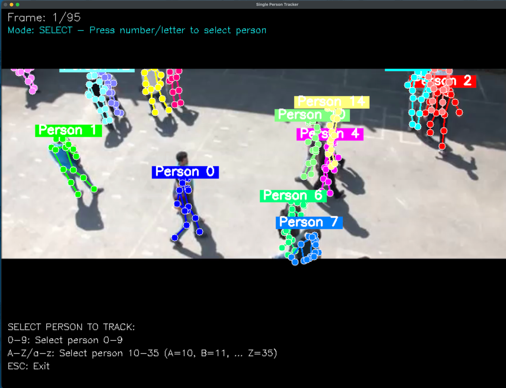
7. Vlastní neurovoná síť
## 2. První pokus - Jednosměrová detekce (1 stage)
Vyzkoušel jsem použití YOLO modelů yolo8x-pose.pt a yolo11x-pose.pt pro současnou detekci osob a extrakci skeletonu.
Tento přístup využívá pouze jeden model, který v jednom kroku detekuje osoby i klíčové body skeletu (tzv. 1 stage detekce).

### Nastavení a výsledky:
- **Confidence threshold**: 0.5 - 0.6 pro detekci osob i klíčových bodů
- **Výkon**: Model odvádí solidní práci v jednodušších scénách s menším počtem osob

### Problémy:
I přes nejlepší možné nastavení model selhává v přeplněných scénách, kde se osoby překrývají nebo jsou v těsné blízkosti.
V těchto situacích dochází k:
- Propásnutí některých osob (false negatives)
- Nepřesné detekci klíčových bodů skeletu
- Záměně klíčových bodů mezi blízkými osobami

Viz ukázky níže:
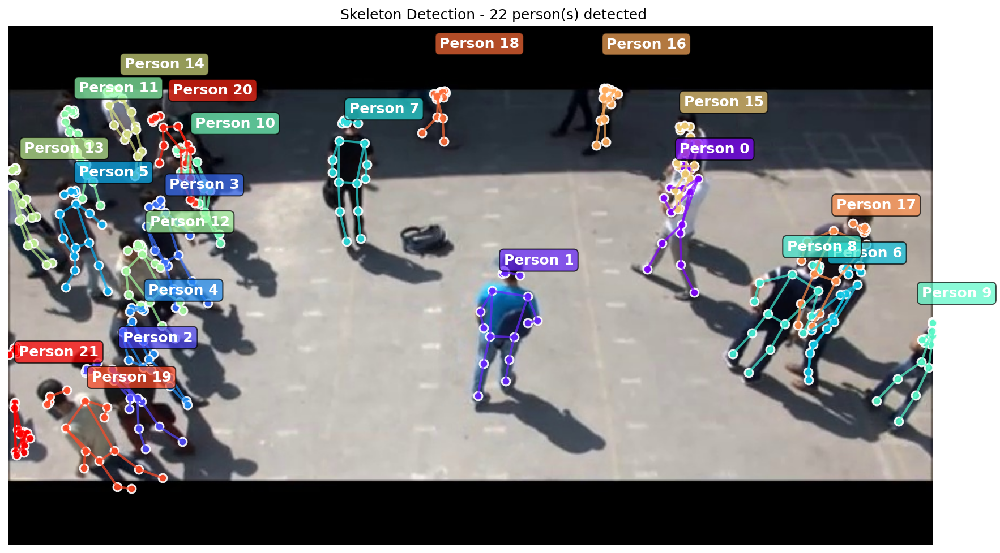
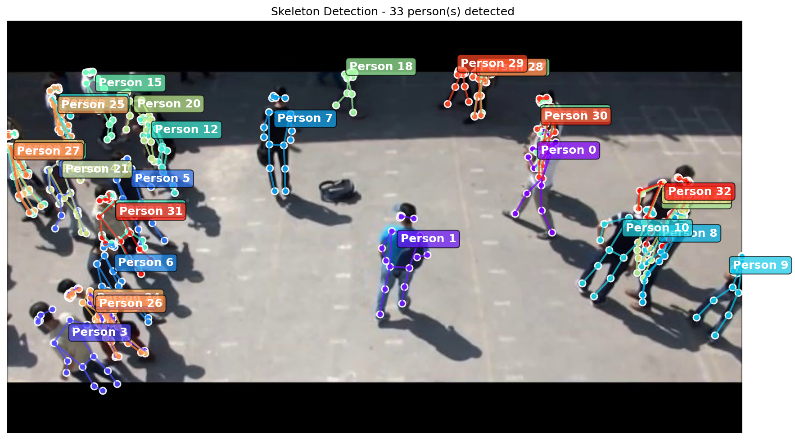

## 3. Druhý pokus - Dvoufázová detekce (2 stage)
Z prvního pokusu jsem zjistil, že YOLO model je výborný pro detekci osob, ale má problémy s přesnou extrakcí skeletu v přeplněných scénách.
Proto jsem se rozhodl použít dvoufázovou (2 stage) detekci:

**Fáze 1**: Detekce osob pomocí YOLO modelu (rychlá a přesná lokalizace bounding boxů osob)
**Fáze 2**: Extrakce skeletu pomocí VitPose modelu (přesná detekce klíčových bodů uvnitř každého bounding boxu zvlášť)

Tato metoda umožňuje využít výhody obou modelů - rychlost a robustnost YOLO pro detekci osob a vysokou přesnost VitPose pro klíčové body skeletu.

### 3.1. Yolo 11x a VitPose - Základní nastavení
**Nastavení:**
- **YOLO 11x**: Confidence threshold 0.5 - 0.6 pro detekci osob
- **VitPose**: Extrakce klíčových bodů z detekovaných bounding boxů

**Výsledky:**
Kombinace těchto dvou modelů poskytuje výrazně lepší výsledky než jednosměrová detekce, zejména v přeplněných scénách.
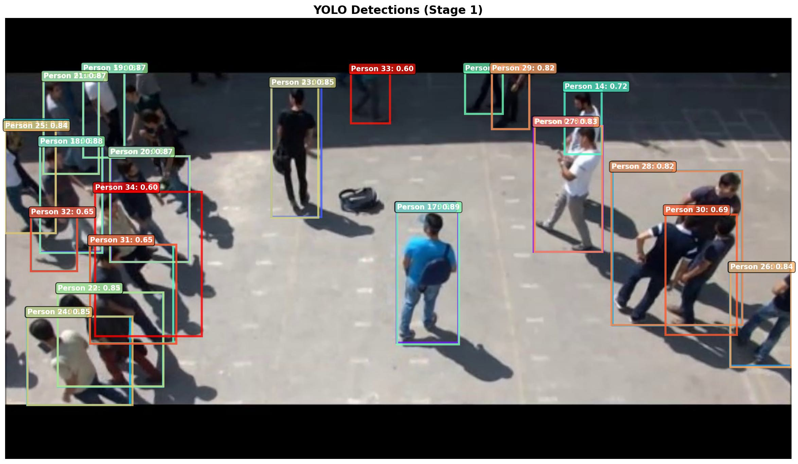
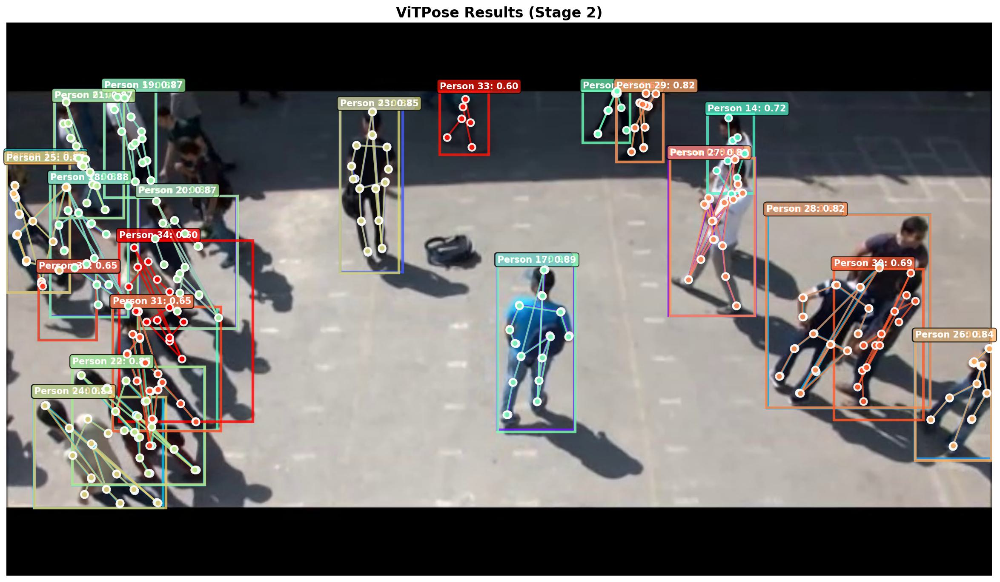

**Pokročilé nastavení YOLO s preprocessing technikami:**

Pro zlepšení detekce osob v různých scénách používám metodu `better_detection`, která kombinuje více preprocessing technik s různými konfiguracemi YOLO:

**Preprocessing techniky:**
1. **Originální obrázek** - bez úprav
2. **Shadow Suppression** - odstranění stínů pomocí dilatace a mediánového filtru
3. **CLAHE** (Contrast Limited Adaptive Histogram Equalization) - adaptivní vyrovnání histogramu v LAB barevném prostoru
4. **Histogram Equalization** - globální vyrovnání histogramu v YUV prostoru
5. **Gamma Correction** (γ=1.3) - úprava jasu

**YOLO konfigurace pro každou techniku:**
```python
configs = [
    {'conf': 0.65, 'imgsz': 1280, 'iou': 0.6},  # Vysoká confidence, střední rozlišení
    {'conf': 0.60, 'imgsz': 1024, 'iou': 0.6},  # Vyvážená konfigurace
    {'conf': 0.60, 'imgsz': 1536, 'iou': 0.6},  # Větší rozlišení pro detaily
    {'conf': 0.55, 'imgsz': 1792, 'iou': 0.7},  # Vysoké rozlišení, nižší confidence
    {'conf': 0.40, 'imgsz': 2048, 'iou': 0.6},  # Maximální rozlišení, nízká confidence
]
```

**Princip fungování:**
- Každý preprocessing vytvoří variantu obrázku optimalizovanou pro jiné světelné podmínky
- Pro každou variantu se provede detekce s odpovídající konfigurací
- Systém vybere výsledky s nejvyšším celkovým confidence score
- Na finální detekce se aplikuje NMS (Non-Maximum Suppression) pro odstranění duplicit

**Výhody tohoto přístupu:**
- Robustní detekce v různých světelných podmínkách
- Lepší detekce osob ve stínu nebo na přesvětlených místech
- Vyšší recall při zachování přijatelné precision


#### 3.1.1. Optimalizace: Odstranění stínů
Prvním krokem optimalizace bylo odstranění stínů z obrázků, které někdy způsobovaly falešné detekce.

**Před odstraněním stínů:**
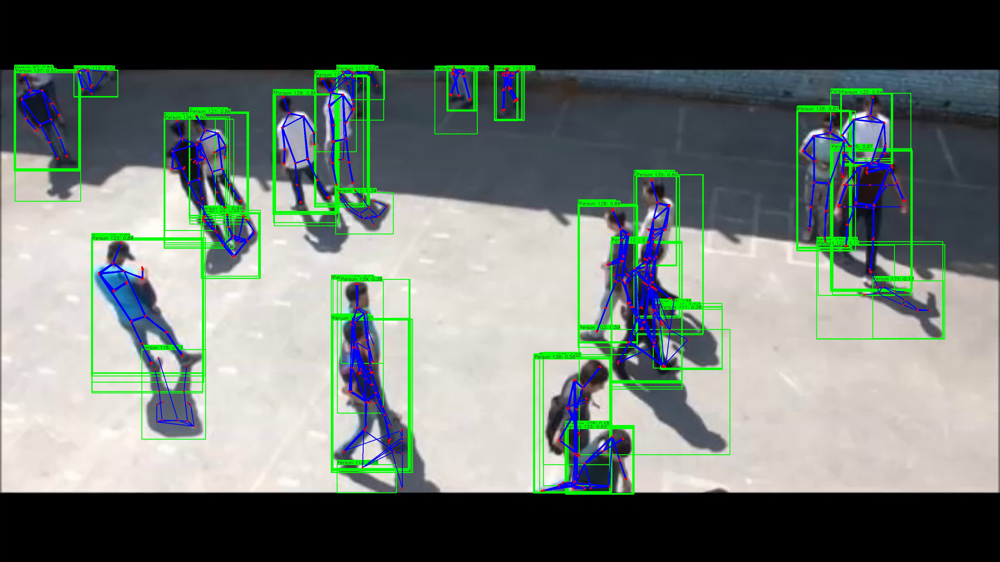

**Po odstranění stínů:**
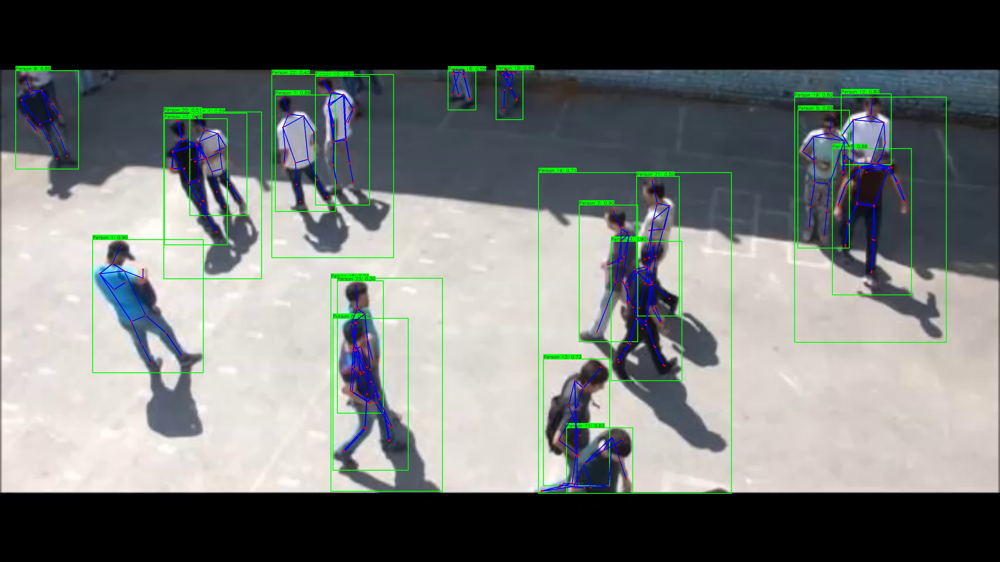

#### 3.1.2. Optimalizace: SAHI (Slicing Aided Hyper Inference)
SAHI technika rozděluje obrázek na menší části a detekuje objekty v každé části zvlášť, což pomáhá s detekcí malých či vzdálených osob.
Po testování bylo zjištěno, že SAHI nepřináší dostatečné zlepšení pro dodatečnou výpočetní náročnost, proto bylo odstraněno.

**Bez SAHI:**
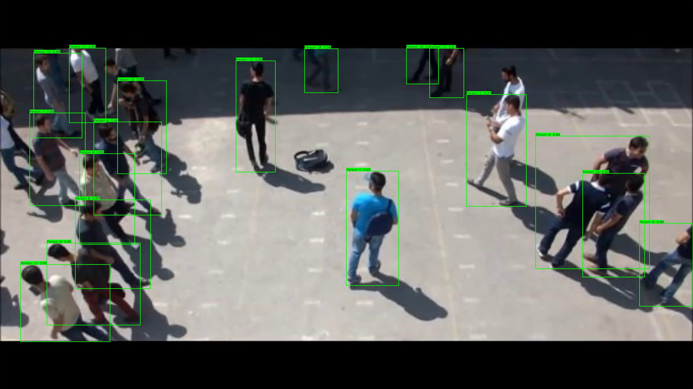

**S SAHI:**
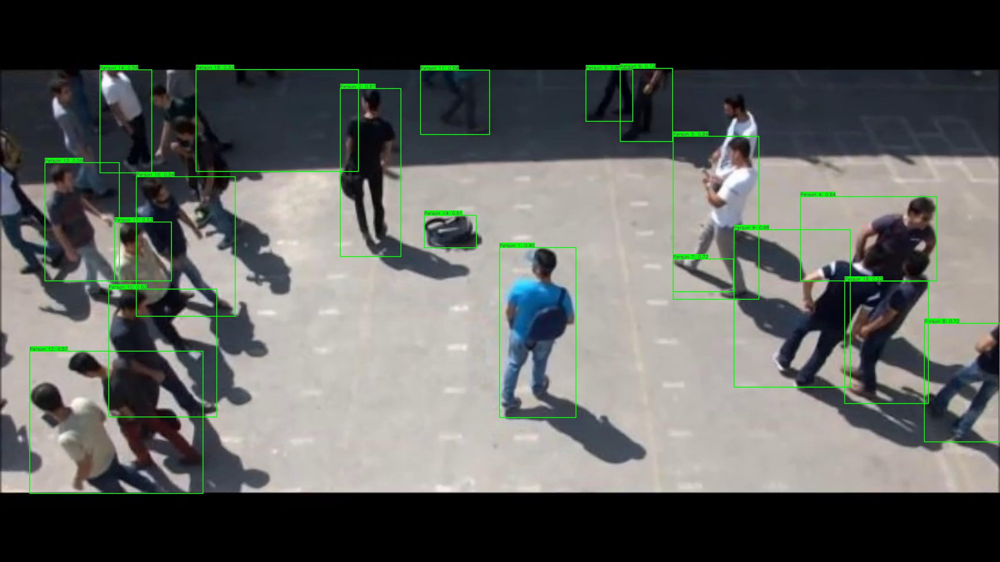

#### 3.1.3. Optimalizace: NMS (Non-Maximum Suppression)
NMS algoritmus odstraňuje duplicitní detekce stejné osoby pomocí potlačení překrývajících se bounding boxů s nižší confidence hodnotou.

**Bez NMS:**


**S NMS:**
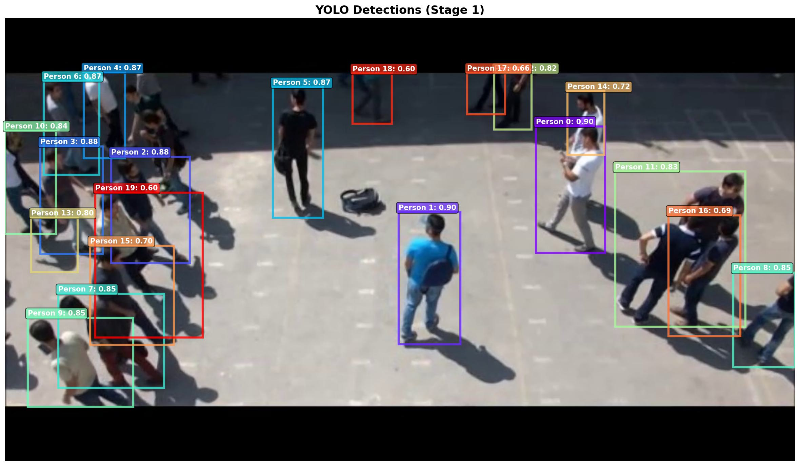

### 3.2. Porovnání detektorů: RT-DETR v2 vs YOLO 11
Pro zlepšení detekce osob jsem porovnal dva state-of-the-art detektory objektů:
- **YOLO 11x**: Rychlý, real-time detektor
- **RT-DETR v2**: Transformer-based detektor s potenciálně vyšší přesností

**Poznámka k testu:**
Tento test porovnává **čisté výkony obou modelů** bez jakýchkoliv optimalizací:
- **Bez NMS** (Non-Maximum Suppression) - používá se pouze vestavěné NMS z modelů
- **Bez preprocessing** - žádné CLAHE, histogram equalization, gamma korekce
- **Bez multiple configs** - pouze jedna konfigurace pro každý model
- **Standardní inference** - originální obrázky, stejné parametry (conf, imgsz=640)

Jedná se o férové porovnání základních schopností obou modelů.

#### Test 1: Confidence threshold 0.5

**RT-DETR R101 (aktuální produkční model):**

*Vizuální porovnání:*
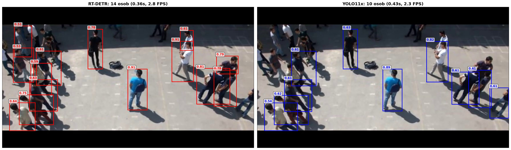

*Metriky výkonu:*
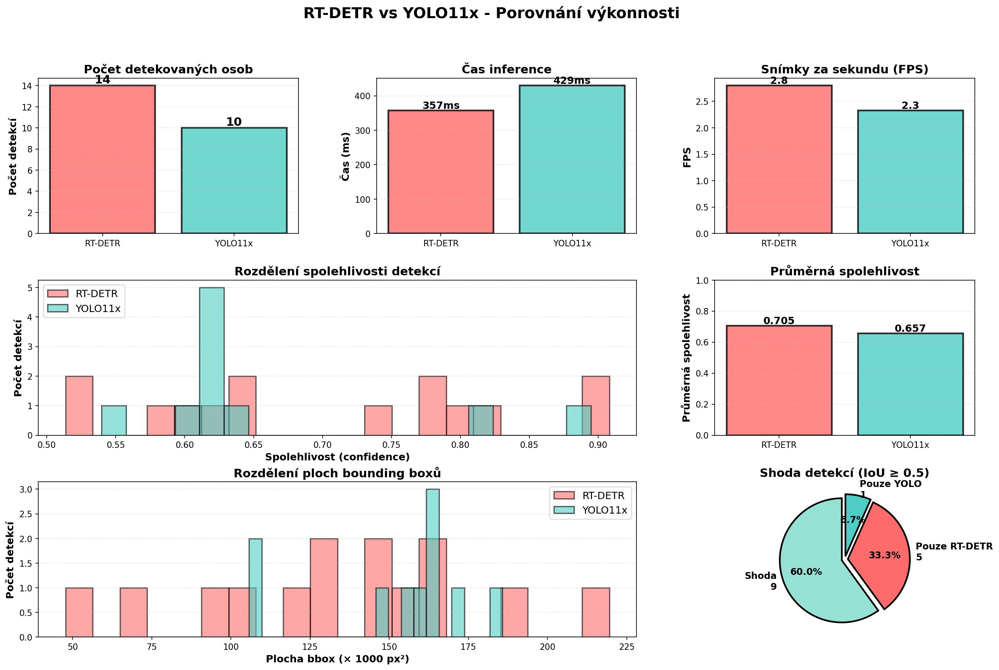

**RT-DETR R18 (pro referenci - rychlejší varianta):**

*Vizuální porovnání:*


*Metriky výkonu:*


**Závěry:**
Oba RT-DETR modely (R101 i R18) vykazují konzistentně **vyšší confidence skóre** u všech detekcí ve srovnání s YOLO 11x při stejném confidence prahu 0.5.
To znamená:
- Můžu **zvýšit confidence threshold** (např. na 0.7-0.8) a přesto zachovat nebo zlepšit recall
- Vyšší práh pomůže **eliminovat falešné pozitivní detekce**
- RT-DETR je navíc **rychlejší** než YOLO 11x při inferenci

Díky těmto výhodám mohu:
1. Použít **přísnější práh confidence** pro čistší detekce
2. Použít **větší a přesnější VitPose model** v druhé fázi, protože RT-DETR ušetří výpočetní čas v první fázi
3. Dosáhnout **lepší celkové přesnosti** pipeline bez kompromisů ve výkonu

#### Test 2: Confidence threshold 0.3 (pro zajímavost)

Pro srovnání s nižším confidence threshold, který umožňuje detekovat více osob (vyšší recall):

**Poznámka:** Všechny výsledky v této složce používají **RT-DETR R18** model.

**Vizuální porovnání:**
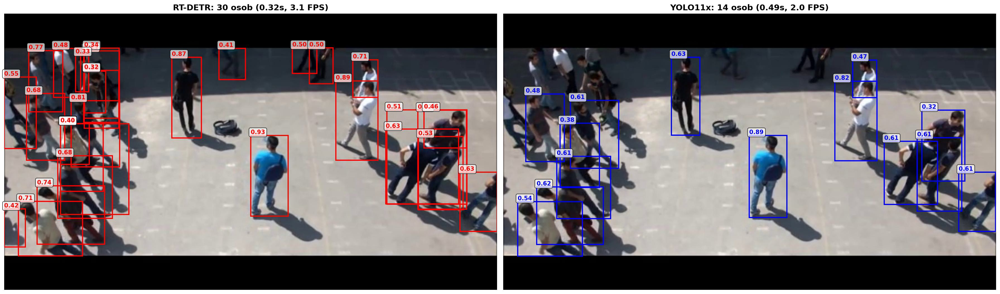

**Metriky výkonu:**
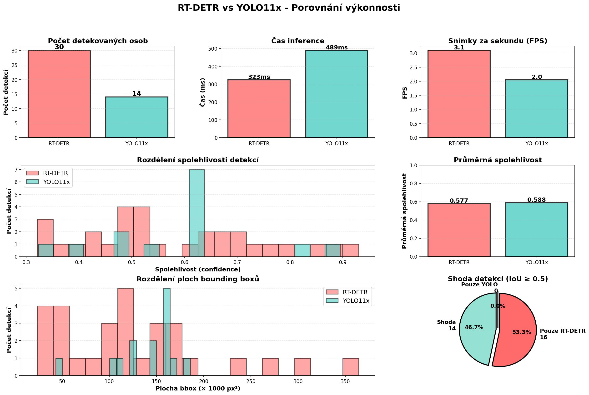

**Závěry:**
I při nižším prahu 0.3 a s lehčím R18 modelem RT-DETR udržuje konzistentně vyšší confidence skóre a detekuje více osob s vyšší jistotou. To potvrzuje, že i rychlejší varianta RT-DETR poskytuje robustnější detekce než YOLO 11x.

### 3.3. RT-DETR a VitPose
Kombinace RT-DETR pro detekci osob a VitPose pro extrakci skeletu představuje finální řešení pro produkční pipeline.

**Scénář 1: Menší počet osob (3 osoby v blízkosti)**

RT-DETR zvládá výborně detekci i když jsou osoby blízko sebe:
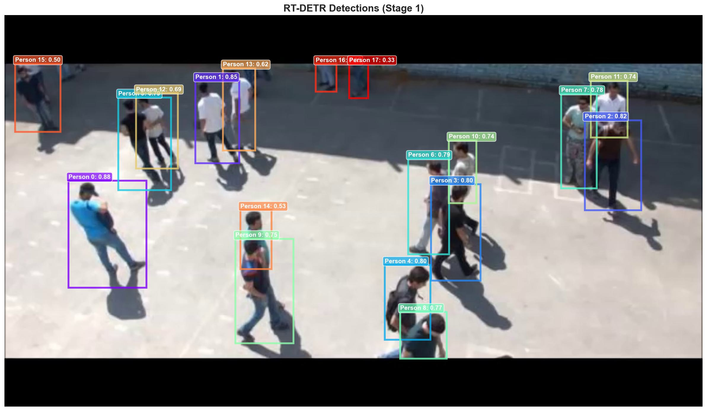

**Scénář 2: Velký dav lidí**

RT-DETR detekuje téměř všechny osoby i v přeplněné scéně. Když jsou lidé velmi těsně u sebe (překrývají se), může dojít k menším nepřesnostem - toto je oblast pro budoucí vylepšení:
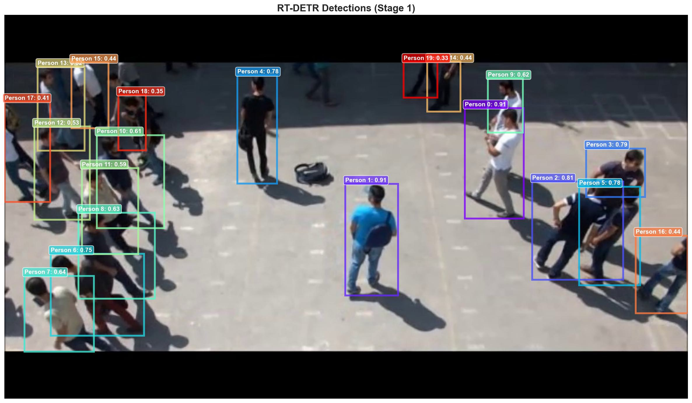

**Silné stránky kombinace RT-DETR + VitPose:**
- Robustní detekce osob i v náročných scénách
- Přesná extrakce skeletu díky ViTPose-Huge modelu
- 3 osoby blízko sebe: zvládá perfektně
- Velké davy: detekuje téměř všechny osoby, ale překrývající se postavy vyžadují další optimalizaci

---

## Reference

### Detekce osob

**RT-DETR** (Real-Time Detection Transformer):
```
Lv, W., Xu, S., Zhao, Y., Wang, G., Wei, J., Cui, C., Du, Y., Dang, Q., & Liu, Y. (2023).
DETRs Beat YOLOs on Real-time Object Detection.
arXiv preprint arXiv:2304.08069.
https://arxiv.org/abs/2304.08069
```

**RT-DETRv2**:
```
Lv, W., Zhao, Y., Chang, Q., Huang, K., Wang, G., & Liu, Y. (2024).
RT-DETRv2: Improved Baseline with Bag-of-Freebies for Real-Time Detection Transformer.
arXiv preprint arXiv:2407.17140.
https://arxiv.org/abs/2407.17140
```

**YOLO11** (Ultralytics):
```
Jocher, G., Chaurasia, A., & Qiu, J. (2023).
Ultralytics YOLO (Version 11.0.0) [Computer software].
https://github.com/ultralytics/ultralytics
```

### Extrakce skeletu

**ViTPose**:
```
Xu, Y., Zhang, J., Zhang, Q., & Tao, D. (2022).
ViTPose: Simple Vision Transformer Baselines for Human Pose Estimation.
In Advances in Neural Information Processing Systems (NeurIPS).
arXiv preprint arXiv:2204.12484.
https://arxiv.org/abs/2204.12484
```

**MMPose**:
```
MMPose Contributors. (2020).
OpenMMLab Pose Estimation Toolbox and Benchmark.
https://github.com/open-mmlab/mmpose
```

### Dataset

**Motion Emotion Dataset (MED)**:
```
Hossein Mousavi. (2023).
Motion Emotion Dataset (MED) - A dataset for human behavior analysis.
GitHub repository.
https://github.com/hosseinm/med
```

### Super-Resolution

**ESPCN** (Efficient Sub-Pixel Convolutional Neural Network):
```
Shi, W., Caballero, J., Huszár, F., Totz, J., Aitken, A. P., Bishop, R., ... & Wang, Z. (2016).
Real-time single image and video super-resolution using an efficient sub-pixel convolutional neural network.
In Proceedings of the IEEE Conference on Computer Vision and Pattern Recognition (CVPR).
```

---
