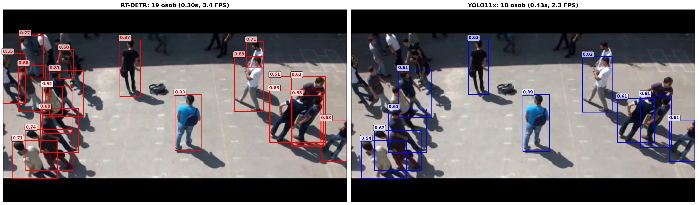
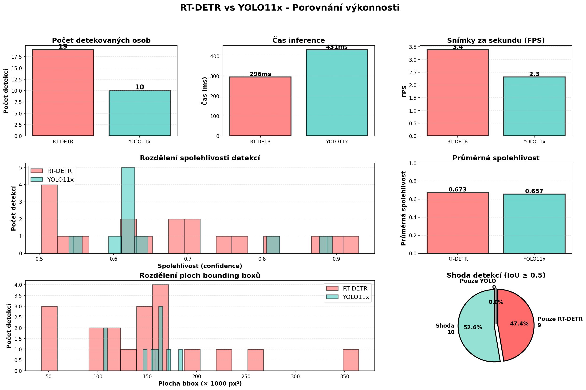

# Analýza pohybu osob ve videu s využitím neuronových sítí pro prostorově-temporální zpracování

## 1. Vytvoření datasetu
Pro vytvoření modelu k detekci podezřelých osob ve videu potřebuju dataset. Jelikož žádný takový neexistuje, musím si ho
sám vytvořit. Jelikož se snažím vytvořit co nejpřesnější dataset, tak používám co nejvíce přesné modely, i když jsou pomalejší.
1. Extrakce obrázku z videa
   - soubor extract_frames.py z videí každou 0.5 sekundy vezme obrázek
2. Zvětšení rozlišení obrázků
   - rozlišení na 4K pomocí ESPCN_x4.pb.
   - pro nasazení pravděpodobně kvalita maximálne 2K
3. Model na detekci lidí
4. Model na detekci podezřelých předmětů (zatím neimplementováno)
5. Model pro vytvoření skeletonů lidí
6. Popsat dataset
   - pomocí label_skeletons.py
   - trackuju ručně člověka a říkám co dělá
   
7. Vlastní neurovoná síť
## 2. První pokus - Jednosměrová detekce (1 stage)
Vyzkoušel jsem použití YOLO modelů yolo8x-pose.pt a yolo11x-pose.pt pro současnou detekci osob a extrakci skeletonu.
Tento přístup využívá pouze jeden model, který v jednom kroku detekuje osoby i klíčové body skeletu (tzv. 1 stage detekce).

### Nastavení a výsledky:
- **Confidence threshold**: 0.5 - 0.6 pro detekci osob i klíčových bodů
- **Výkon**: Model odvádí solidní práci v jednodušších scénách s menším počtem osob

### Problémy:
I přes nejlepší možné nastavení model selhává v přeplněných scénách, kde se osoby překrývají nebo jsou v těsné blízkosti.
V těchto situacích dochází k:
- Propásnutí některých osob (false negatives)
- Nepřesné detekci klíčových bodů skeletu
- Záměně klíčových bodů mezi blízkými osobami

Viz ukázky níže:

## 3. Druhý pokus - Dvoufázová detekce (2 stage)
Z prvního pokusu jsem zjistil, že YOLO model je výborný pro detekci osob, ale má problémy s přesnou extrakcí skeletu v přeplněných scénách.
Proto jsem se rozhodl použít dvoufázovou (2 stage) detekci:

**Fáze 1**: Detekce osob pomocí YOLO modelu (rychlá a přesná lokalizace bounding boxů osob)
**Fáze 2**: Extrakce skeletu pomocí VitPose modelu (přesná detekce klíčových bodů uvnitř každého bounding boxu zvlášť)

Tato metoda umožňuje využít výhody obou modelů - rychlost a robustnost YOLO pro detekci osob a vysokou přesnost VitPose pro klíčové body skeletu.

### 3.1. Yolo 11x a VitPose - Základní nastavení
**Nastavení:**
- **YOLO 11x**: Confidence threshold 0.5 - 0.6 pro detekci osob
- **VitPose**: Extrakce klíčových bodů z detekovaných bounding boxů

**Výsledky:**
Kombinace těchto dvou modelů poskytuje výrazně lepší výsledky než jednosměrová detekce, zejména v přeplněných scénách.

#### 3.1.1. Optimalizace: Odstranění stínů
Prvním krokem optimalizace bylo odstranění stínů z obrázků, které někdy způsobovaly falešné detekce.

**Před odstraněním stínů:**

**Po odstranění stínů:**

#### 3.1.2. Optimalizace: SAHI (Slicing Aided Hyper Inference)
SAHI technika rozděluje obrázek na menší části a detekuje objekty v každé části zvlášť, což pomáhá s detekcí malých či vzdálených osob.
Po testování bylo zjištěno, že SAHI nepřináší dostatečné zlepšení pro dodatečnou výpočetní náročnost, proto bylo odstraněno.

**Bez SAHI:**

**S SAHI:**

#### 3.1.3. Optimalizace: NMS (Non-Maximum Suppression)
NMS algoritmus odstraňuje duplicitní detekce stejné osoby pomocí potlačení překrývajících se bounding boxů s nižší confidence hodnotou.

**Bez NMS:**

**S NMS:**

### 3.2. Porovnání detektorů: RT-DETR v2 vs YOLO 11
Pro zlepšení detekce osob jsem porovnal dva state-of-the-art detektory objektů:
- **YOLO 11x**: Rychlý, real-time detektor
- **RT-DETR v2**: Transformer-based detektor s potenciálně vyšší přesností

**Nastavení testu:**
- Confidence threshold: 0.5 pro oba modely (stejné podmínky pro férové srovnání)

**Vizuální porovnání:**

**Metriky výkonu:**

**Závěry testu:**
RT-DETR model vykazuje konzistentně **vyšší confidence skóre** u všech detekcí ve srovnání s YOLO 11x při stejném confidence prahu 0.5.
To znamená:
- Můžu **zvýšit confidence threshold** (např. na 0.7-0.8) a přesto zachovat nebo zlepšit recall
- Vyšší práh pomůže **eliminovat falešné pozitivní detekce**
- RT-DETR je navíc **rychlejší** než YOLO 11x při inferenci

Díky těmto výhodám mohu:
1. Použít **přísnější práh confidence** pro čistší detekce
2. Použít **větší a přesnější VitPose model** v druhé fázi, protože RT-DETR ušetří výpočetní čas v první fázi
3. Dosáhnout **lepší celkové přesnosti** pipeline bez kompromisů ve výkonu

### 3.3. RT-DETR a VitPose
Kombinace RT-DETR pro detekci osob a VitPose pro extrakci skeletu.